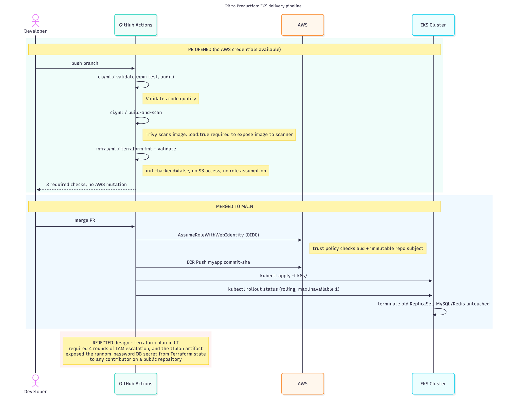
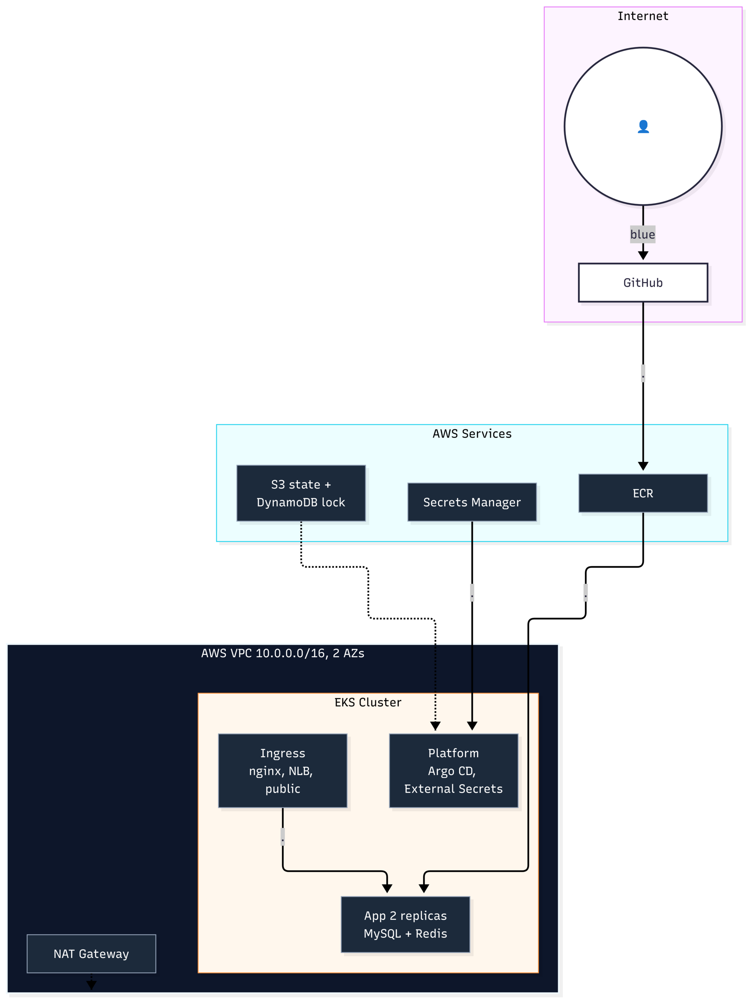
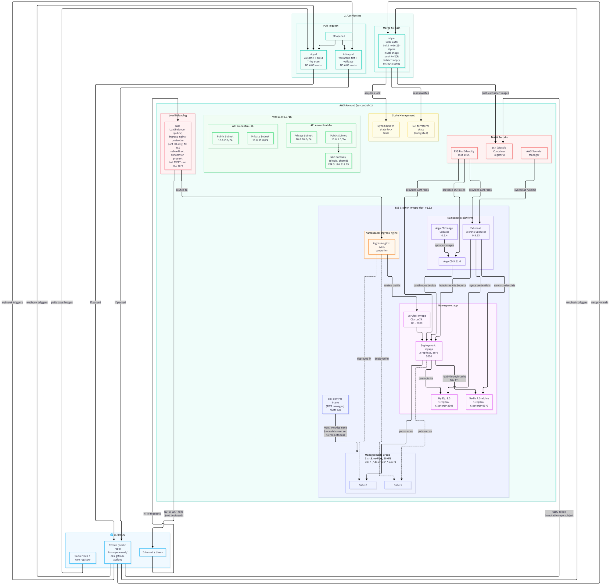
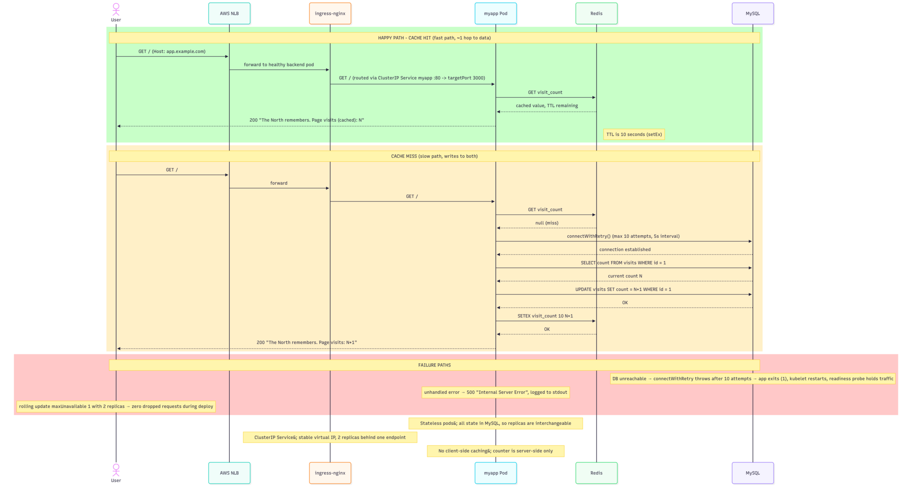

# EKS GitHub Actions

A three-tier Node.js application on Amazon EKS, deployed through GitHub Actions
with OIDC authentication. Everything is defined in Terraform; every workload
runs as a GitOps-managed Kubernetes manifest.

**Live endpoint** — the app returns `The North remembers. Page visits: N`.

```bash
kubectl -n app port-forward svc/myapp 8081:80
curl -s http://localhost:8081/
```

The load balancer address is `http://a1817f87af9544743a180bf81c70a6c9-2122398358.eu-central-1.elb.amazonaws.com/`
— reachable from inside the VPC. From a residential connection port 80 gets
intercepted by the ISP (a `307` to a redirect page, with `Via: 1.0 middlebox`
in the response). That is not the application. Terminating TLS on the load
balancer is what prevents it.

---

## Architecture

### Full architecture



### Simplified overview



### Cluster state



### Request path



---

## What's here

| Layer | Component |
| --- | --- |
| VPC | `10.0.0.0/16`, 2 AZs, public + private subnets, 1 shared NAT gateway |
| Cluster | EKS `myapp-dev`, v1.32, control plane AWS-managed |
| Nodes | Managed node group, 2 × `t3.medium`, 20 GiB, min 1 / desired 2 / max 3 |
| Ingress | `ingress-nginx` 4.9.1 behind one NLB — the only public IP |
| App | Node 22.23.3 on Alpine 3.24.2, 2 replicas, port 3000 |
| Data | MySQL 8.0 and Redis 7.0-alpine, one replica each, ClusterIP |
| Cache | 10-second read-through TTL on the visit counter |
| Platform | Argo CD 5.51.6, External Secrets 0.9.13, Argo CD Image Updater 0.9.4 |
| Secrets | `random_password` → Secrets Manager → External Secrets → Kubernetes Secret |

### Repository layout

```
infra/envs/dev/     the only root module you apply
modules/            vpc, eks, ecr, secrets, pod-identity,
                    github-oidc, helm-release, ingress
nodeapp/            Express app, multi-stage Dockerfile
k8s/                Kubernetes manifests, applied by cd.yml
.github/workflows/  ci, infra, cd
```

---

## CI/CD

Three workflows, separated by what they are allowed to do.

| Workflow | Trigger | AWS access |
| --- | --- | --- |
| `ci.yml` | pull request | none — tests, build, Trivy scan |
| `infra.yml` | PR touching `infra/**` or `modules/**` | none — `terraform fmt` + `validate` |
| `cd.yml` | push to `main` | OIDC — build, push to ECR, deploy, await rollout |

`infra.yml` runs `terraform init -backend=false`, which skips S3 entirely and
resolves providers from the lock file. It has no `id-token: write`, so it cannot
assume a role even if a step tried.

### Authentication

No static AWS keys exist in this setup. `cd.yml` gets short-lived credentials
by presenting a signed OIDC identity token. Roles trust
`repo:<orgID>/<repoID>:environment:production` — the GitHub *environment* is
part of the subject, so configuring required reviewers on that environment
gates the deploy. A forked repository cannot satisfy that claim.

| Role | Trusts | Can do |
| --- | --- | --- |
| `myapp-ci-ecr-push` | `ref:refs/heads/main` or `environment:production` | 11 ECR actions, 9 scoped to `repository/myapp` |
| `myapp-infra-apply` | `environment:production` only | EKS cluster-admin |
| `myapp-infra-plan` | `pull_request` | nothing — zero permissions |

---

## Commands

```bash
export AWS_PROFILE=myapp
```

### Application

```bash
kubectl -n app get pods
kubectl -n app get deploy,svc,ingress
kubectl -n app logs deploy/myapp --tail=20
kubectl -n app port-forward svc/myapp 8081:80   # → http://localhost:8081
```

### Confirm the runtime image is hardened

```bash
kubectl -n app exec deploy/myapp -- node --version
kubectl -n app exec deploy/myapp -- sh -c \
  'cat /etc/alpine-release; command -v npm || echo REMOVED'
```

```
v22.23.3
3.24.2
npm: REMOVED
```

### Self-healing

```bash
kubectl -n app delete pod <pod-name> --force --grace-period=0
kubectl -n app get pods -w     # replacement is Running within seconds
```

### Reach the app from inside the VPC

Bypasses ISP interception:

```bash
kubectl -n app exec deploy/myapp -- wget -qO- \
  --header="Host: app.example.com" \
  http://a1817f87af9544743a180bf81c70a6c9-2122398358.eu-central-1.elb.amazonaws.com/
```

### EC2 instances and cluster nodes

Each node maps to an EC2 instance through its provider ID:

```bash
kubectl get nodes -o wide
kubectl get nodes -o jsonpath='{range .items[*]}{.spec.providerID}{"\n"}{end}'
# aws:///eu-central-1a/i-0d3a27a3a920b8d93
# aws:///eu-central-1b/i-0a452c83c68847b38

aws eks describe-nodegroup --cluster-name myapp-dev \
  --nodegroup-name myapp-node-group \
  --query 'nodegroup.{status:status,scaling:scalingConfig,nodeRole:nodeRole}'

aws iam list-attached-role-policies --role-name myapp-eks-node-group-role \
  --query 'AttachedPolicies[].PolicyName'
```

Nodes are launched by an AutoScalingGroup from a LaunchTemplate. The userdata
runs `bootstrap.sh`, which configures the kubelet with the cluster endpoint and
a bootstrap token, then installs the CNI and CSI plugins. Once the kubelet
registers, the EC2 instance is a Kubernetes Node — no SSH, nothing else to do.

The node role holds three policies: `AmazonEKSWorkerNodePolicy` (read config
and join), `AmazonEKS_CNI_Policy` (pod networking), and
`AmazonEC2ContainerRegistryReadOnly` (pull from ECR).

### Secrets

Never `kubectl get secret -o yaml`. Names and counts only:

```bash
kubectl -n app get secret
kubectl get externalsecret -A        # STATUS: SecretSynced
kubectl get clustersecretstore        # myapp-aws  Valid  True
```

Workloads authenticate with **EKS Pod Identity**, not IRSA — the service
account maps to an IAM role and the SDK exchanges it for short-lived
credentials at runtime. Nothing sensitive is in git or in a ConfigMap.

### Infrastructure

```bash
cd infra/envs/dev

terraform fmt -check -recursive   # also walks up into ../../modules
terraform validate
terraform plan
terraform apply
```

State lives in S3 (`myapp-tfstate-042617239394`) with a DynamoDB lock table at
key `infra/dev/terraform.tfstate`. Actions never mutates infrastructure —
`apply` runs from a workstation with your own credentials.

### Pipeline

```bash
gh pr list
gh run list --limit 5
gh run watch <run-id> --exit-status
```

### IAM

```bash
aws iam get-role --role-name myapp-infra-apply \
  --query 'Role.AssumeRolePolicyDocument.Statement[].Condition' --output json

aws iam list-attached-role-policies --role-name myapp-infra-plan \
  --query 'AttachedPolicies[].PolicyName'   # empty — by design
```

---

## Known gaps

Listed deliberately. Each one has a fix and a reason it hasn't been done.

| Gap | Impact | Fix |
| --- | --- | --- |
| No readiness probe | up to 50 s where the pod is `Running` but can't serve | report NotReady until MySQL is reachable |
| No resource requests or limits | blocks HPA and per-container metrics; no noisy-neighbour isolation | set from observed usage |
| No topology spread constraint | 2 pods on 2 nodes is scheduler luck, not policy | `whenUnsatisfiable: DoNotSchedule` |
| No TLS certificate | port 443 returns 404; `ssl-redirect` annotation is inert | Route 53 domain + ACM DNS validation |
| No metrics pipeline | logs only — can't answer "is it degrading" | `prom-client` + Container Insights |
| MySQL single replica, no volume | pod restart can lose data | RDS Multi-AZ |
| Redis single replica | losing it loses the endpoint — the code doesn't fall back to MySQL | cache-aside with try/catch |
| No WAF | public IP already receiving scanner traffic | WAF at the edge |
| Counter does read-modify-write | concurrent requests lose increments | `UPDATE ... SET count = count + 1` |
| New MySQL connection per request | handshake and auth on every hit | `mysql2` pool |
| `ci-ecr-push` trusts a branch ref | weaker than the environment condition | trust only `environment:production` |

Priority order: resource requests, then the readiness probe, then TLS, then
metrics — with a real alert destination before writing any rules.

---

## Notes

- `app.example.com` is a placeholder; no domain is registered.
- Two application bugs are intentional and documented above: the lost-update
  race and the per-request connection. Both are on the fix list.
- `docs/` and `interview/` are gitignored — they hold working notes.